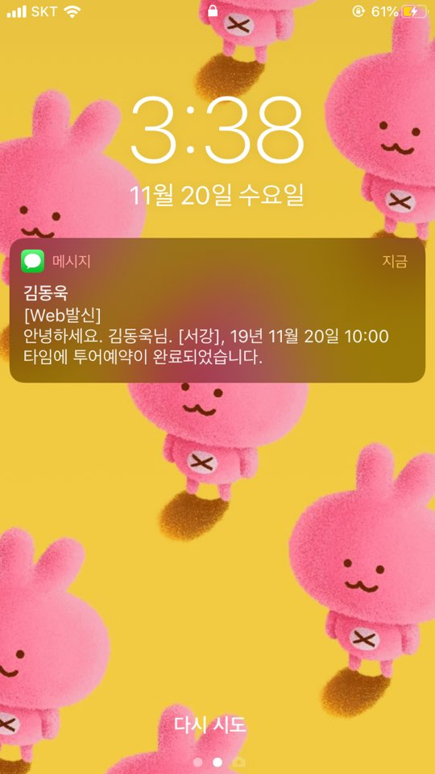
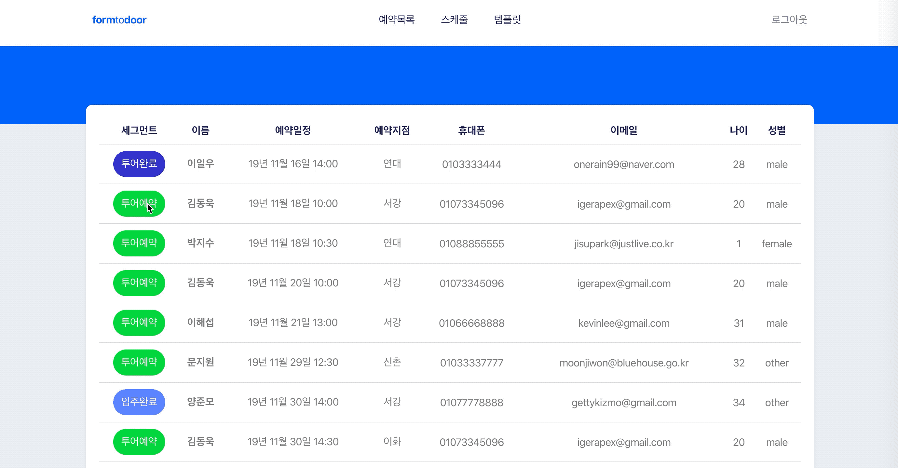
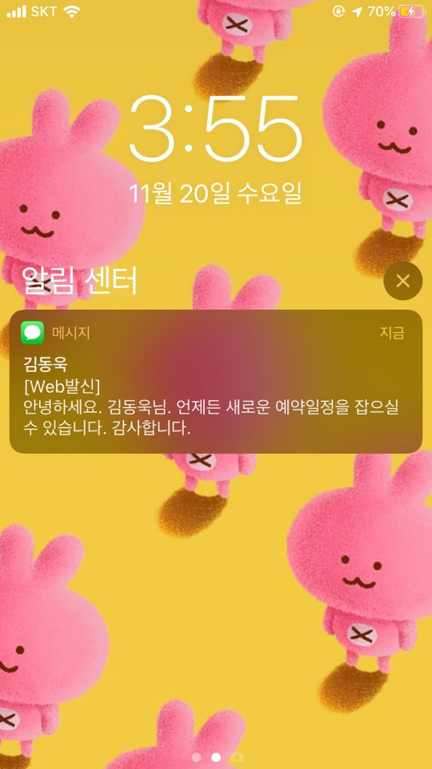
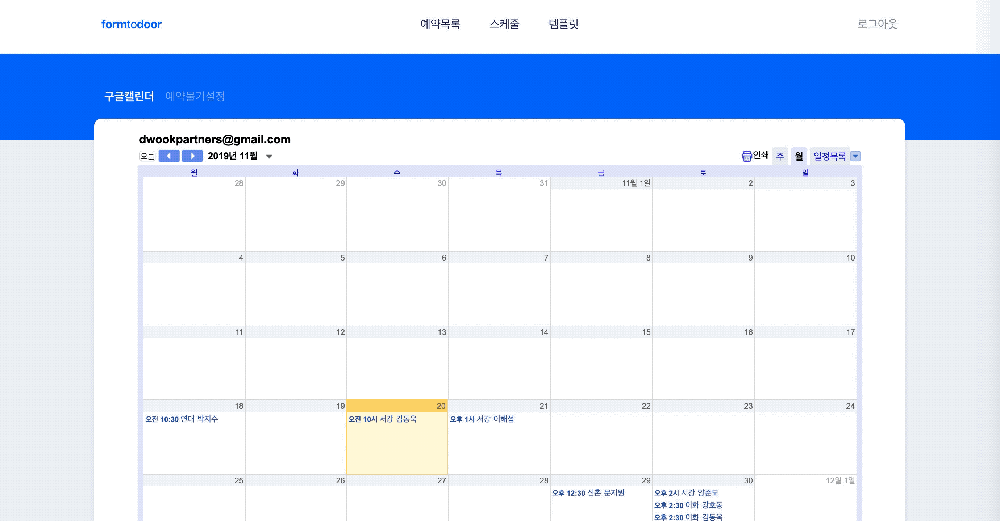
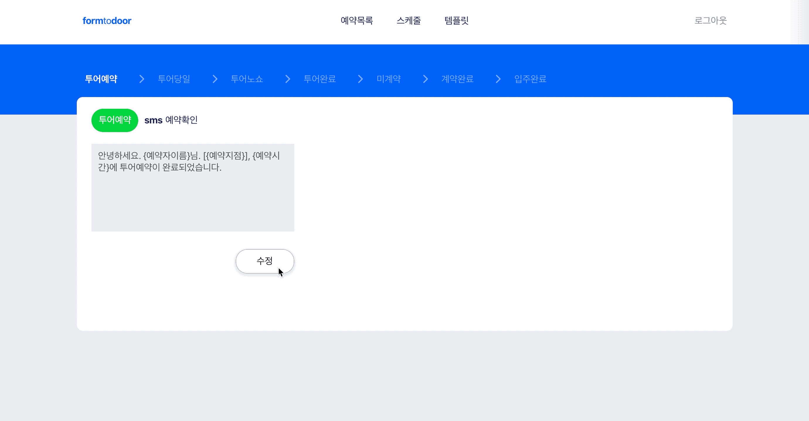

# Introduction

- 방문 예약 고객관리 웹 어플리케이션
- ‘방문 예약’ 부터 ‘입주 완료’까지 예약자의 구매퍼널 단계를 구분하여 맞춤화된 SMS 발송
- 구글 캘린더와 연동한 방문 예약 스케줄 관리

# Features

- 방문 예약 고객정보 조회 및 변경
- 예약정보 구글 캘린더에 자동입력 및 조회
- 관리자의 특정 타임 예약 불가 설정
- 예약자의 구매퍼널 단계별 SMS 템플릿 조회 및 변경
- 예약자의 구매퍼널 단계를 변경하면 미리 작성된 템플릿이 자동발송

## User Case

1. 고객의 방문 예약 신청 <br/>
   

2. 고객에게 전달되는 예약 확인 SMS <br/>
   

3. 관리자가 확인하는 방문 예약 리스트 및 고객 세그먼트 변경 과정 <br/>
   

4. 고객이 노쇼를 할 경우 발송 되는 SMS <br/>
   

5. 관리자가 확인하는 예약스케줄 및 예약불가 설정 <br/>
   

6. 구매퍼널 단계별 SMS 템플릿 조회 및 변경 <br/>
   

# Requirement

- 최신 Chrome Browser 사용을 권장
- 고객용 클라이언트 페이지는 로그인이 없음
- 관리자용 클라이언트 페이지는 Firebase 구글 로그인을 사용

# Installation

## (1) Client - 고객용

```
git clone https://github.com/dwook/justlive-client
cd justlive-client
npm install
npm start
```

## (2) Client - 관리자용

```
git clone https://github.com/dwook/form-to-door-client
cd form-to-door-client
npm install
npm start
```

## (3) Server

```
git clone https://github.com/dwook/form-to-door-server
cd form-to-door-server
npm install
npm start
```

# Skills

## (1) Client

- Modern Javascript(ES2015+)
- React를 이용한 컴포넌트 기반의 구조
- React Router
- Sass를 이용한 스타일링
- Google Firebase 인증 (관리자용)

## (2) Server

- Modern Javascript(ES2015+)
- Node.js
- Express.js
- MongoDB Atlas/Mongoose를 이용한 고객, 예약, SMS 템플릿 정보 저장
- Google Calendar API를 이용한 이벤트 생성
- Toast SMS API를 이용한 SMS 발송

# Version Control

- Git과 Github을 이용한 Version Control
- Client와 Server의 독립적인 관리를 위해 Git Repository 분리

# Project Control

- Notion을 이용한 스케줄 관리 및 Task 정리
- Figma를 이용한 유저 인터페이스 디자인 설계

# Deployment

## (1) Client

- Netlify를 이용한 Client 배포
- Amazon ACM (AWS Certificate Manager)을 사용하여 SSL 관리
- Client - 고객용 [https://www.dwook.online](https://www.dwook.online)
- Client - 관리자용 [https://www.formtodoor.online](https://www.formtodoor.online/)

## (2) Server

- Circle CI 배포자동화
- AWS Elastic Beanstalk 이용한 Server 배포
- https-client와 http-server 간의 연결을 위해 로드 밸런서 사용

# Challenges

- Node 환경에서 구글 캘린더 API 사용을 위한 인증하기 위한 방법이 로컬환경에서는 OAuth 2.0으로 가능했으나 배포 시에 동작하지 않아 배포 이후에 Service account keys 방식으로 변경했습니다. 구글 API를 사용하기 위한 인증 방식에 대해 공부할 수 있는 좋은 기회가 되었습니다.
- 로컬 환경과 배포 환경에서 달라지는 Date 값 때문에 불러오는 예약리스트가 달라지는 것을 확인하고, 배포 환경을 염두하면서 개발해야 한다는 것을 알게 되었습니다.
- HTTPS 배포를 처음하면서 도메인, 통신 프로토콜에 대한 지식을 더 쌓아야겠다는 생각을 했습니다.

# Things to do

- 관리자의 권한을 세분화하여 관리자를 추가하거나 삭제
- 예약정보를 수정할 수 있는 short URL을 고객에게 전송
- 예약정보 필터 및 검색 기능
- 컴포넌트 유닛 테스트
- 서버 API 유닛 테스트
- E2E 테스트
